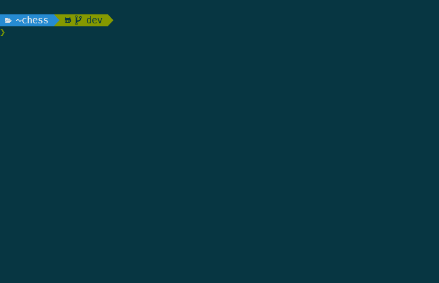

# Chess

Command line application for playing chess implemented in ruby.



## Getting Started

### Prerequisites
In order to run this project, you need to have ruby installed. I recommend using [rbenv](https://github.com/rbenv/rbenv) along with the [ruby-build](https://github.com/rbenv/ruby-build) plugin.

This project has only been tested on ruby version 2.7.1p83.

You will also need to install bundler with
```bash
gem install bundler
```

### Installing

Clone this repository and change your current working directory with
```bash
git clone git@github.com:rankoliang/chess.git; cd chess
```
Next, install the dependencies by running
```bash
bundle
```

### Playing The Game

Play the game by running
```bash
bundle exec ruby lib/chess_client.rb
```

### Running the tests

Run the test suite with
```bash
bundle exec rspec
```

## Features
- Castling
- En Passants
- Promoting pawns to queens
- Undoing moves
- Enforcing (mostly) legal moves
- Saving and loading the game state (default directory: `saves/`)

## Notes
There is no AI, but the moves are shuffled in a semi random order. You can keep on pressing enter to execute random moves.

## Thanks
This project was part of the curriculum of [The Odin Project](https://www.theodinproject.com/courses/ruby-programming/lessons/ruby-final-project). I would like to extend a thank you to the wonderful community behind it.

## License
This project is licensed under the MIT License.
